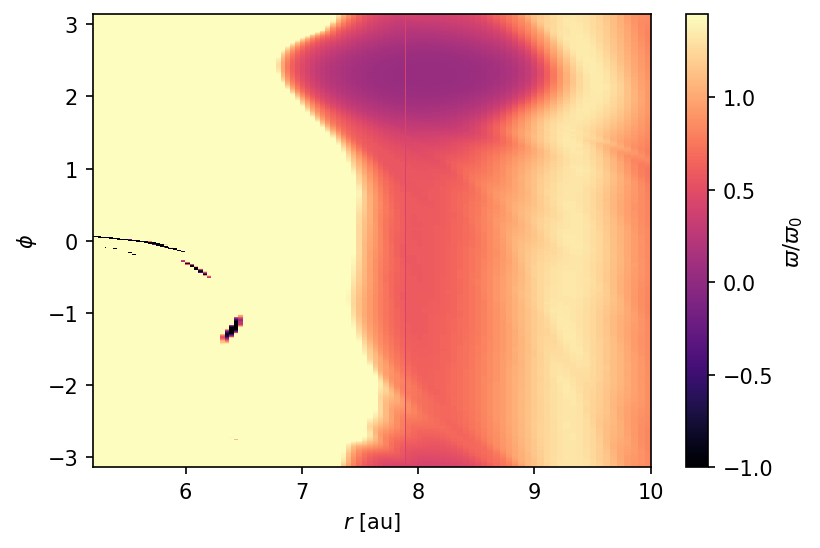
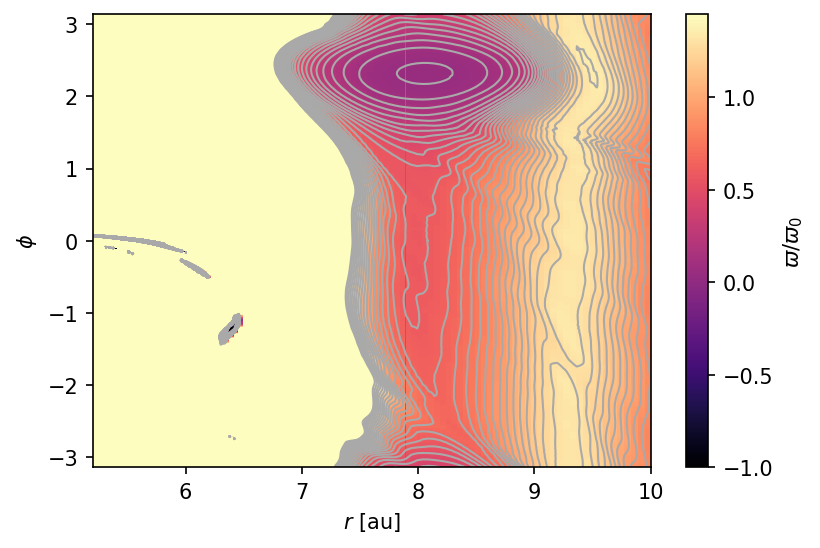
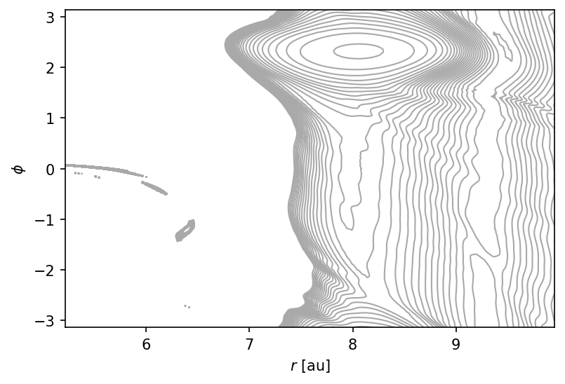
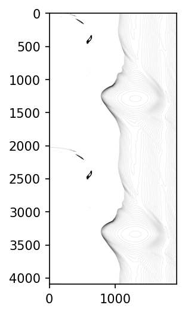
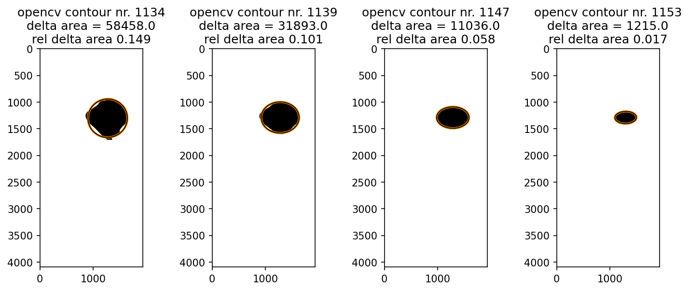
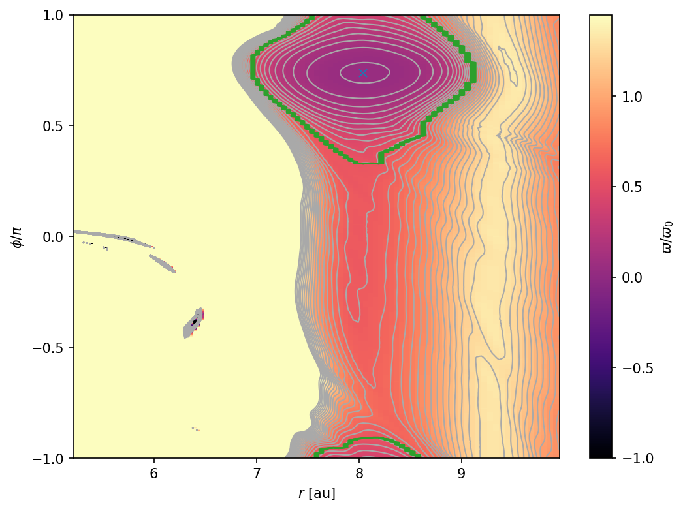
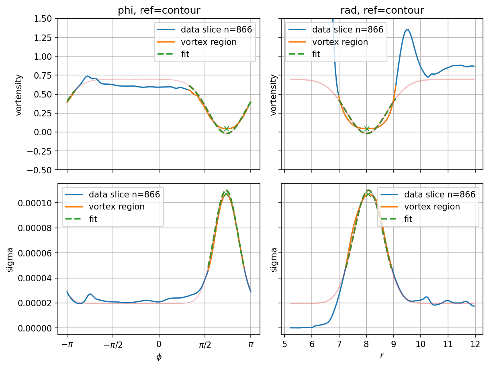
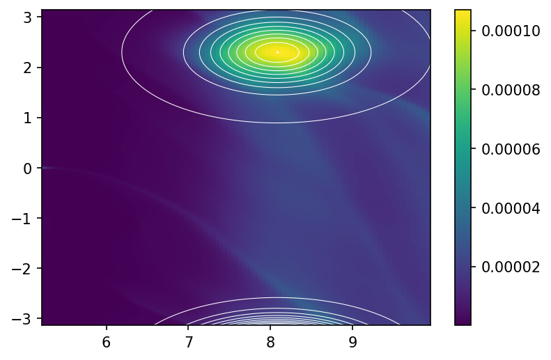
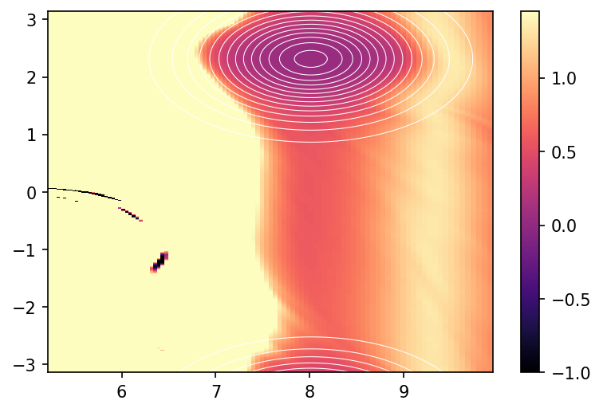
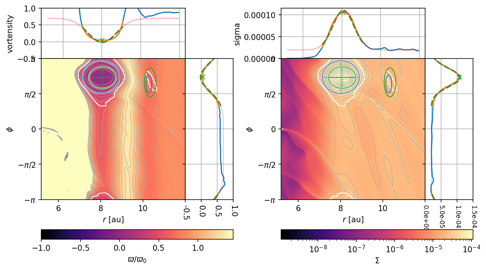

# vortector

A python3 package of an automatic vortex detector for planet-disk simulation data.

## Brief

- **automatically detect vortices** in output of **proto-planetary disk simulations**
- detection based on **geometric shape**
- **2D Gaussian fit** to vortensity and surface density
- allows **precise definition of vortex region** using Gaussian fits
- standalone python3 package

## Dependencies

- numpy
- matplotlib
- opencv-python

## Installation

``` bash
python3 setup.py install --user
```

## Input parameters

2D arrays:

- radii
- azimuth
- vortensity (normalized)
- surface density

algorithm parameters:

- radial range to search
- values of the contours in the vortensity map
- maximum deviation of contours from an ellipse
- maximum of the aspect ratio of the ellipse
- minimum of the drop of vortensity (normalized) inside the vortex

## Output

For each of the vortex candidate, the following information is returned inside a dictionary:

- location
- vortex contour (extend, mask)
- min/max/average/median of vortensity/surface density
- 2D Gaussian fit parameters to vortensity/surface density

## Detect vortices in PPD simulation data

To search for possible vortex candidates with a computer, a simple search for the location of minimum vortensity (the ratio of vorticity and surface density) sometimes works to find the location of a vortex.
Then the value of the vorticity can be used to learn how strongly the vortex spins and the value of surface density can be used as an indication for mass enclosed in the vortex.
This method, however, fails easily for many simulations, e.g. when the vortensity in a tiny region close to a spiral arm launched by the planet is smaller than inside the vortex, or when the gap region intrudes into the outer disk which can strong anti-cycling motion at the disk edge.

To get around these issues, the basic idea of this library is to use the geometrical shape of vortices, as they appear in an image of the disk.
Looking down on the surface of a PPD, vortices appear as banana-shaped object.
In the more suitable r-phi plane,
large vortices in protoplanetary disks (PPD) appear as roundish contours.
In fact, contour lines of the vortensity closely resemble ellipses in the r-phi plane.
The only task to identify vortices in a disk is then to find closed contour lines that closely resemble ellipses.

For the human eye, thanks to the pattern recognition maschine in our heads, this is a trivial task.
Computers need more precise descriptions of what to do.

## Strategy of the vortector

The algorithm of the vortector can be structured into three steps:

1. draw an image of contour lines in the r-phi plane map of the vortensity
2. identify closed contours that closely resemble ellipses as vortex candidates
3. fit a 2D Gaussian function to vortex candidates to extract information

## Algorithm step by step

In this section, we'll go through the process step by step using an example of a particularly large vortex.

### Step 1: contour lines

We start from a color-coded map in the r-phi plane produced with `matplotlib`'s `pcolormesh`.



Using the `contour` function, we can overplot contour lines, here with a spacing of 0.05.



The output we want is an image without the underlying color map.



Finally, we copy the lower half to the top and the upper half to the bottom.
This is done to capture vortices that overlap with the periodic boundary in the azimuthal direction.



### Step 2: find closed contours resembling ellipses

For this step, we make use of the python package `opencv`.
It provides a contour finding function, `findContours`.
In the doubled contour image, 1255 contours are found out of which 42 are closed contours.

Next, we use the `fitEllipse` to fit an ellipse to each closed contour.
As a criterion of deviation from an ellipse, we sum up the areas spanned between the contour and the fitted ellipse.
So both, areas where the contour protrudes outside the ellipse as well as areas where the contour goes inside the ellipse are counted.

Then, to obtain a normalized measure, this area is divided by the area inside the contour.
We only keep contours for which the deviation from an ellipse is smaller than a threshold, which is 0.15 by default.

Here is what a selection of the contours then look like.
The largest contour on the left an edge case wich a relative deviation  of 0.149.


Finally, we discard all the contours that are contained within another contour, which leaves us with the left most contour as the final vortex candidate, which is marked in the following image by the green line.
The blue cross indicates the location of the vortensity minimum inside the vortex.



At this point, it is obvious that the extend of the vortex, and derived quantities such as the mass contained within, are heavily influenced by the choice of the levels used to produce the contour lines and the choice of the maximum relative ellipse deviation.

None the less, the properties of the contour should give an order of magnitude estimate.

### Step 3: fit a 2D gaussian

To alleviate the arbitrariness of the vortex properties, a quantity that does not depend on our parameter choices but on the underlying data is needed.

Upon inspection of the curves of vortensity and surface density along a cut through the vortex, either radial or azimuthal, it becomes clear that these lines closely resemble Gaussians functions (exp(-x^2)).
The nice Gaussian shape can be disturbed by a number of influences though, especially spiral arms.

To capture the 2D nature of the vortex, we fit a 2D Gaussian function to the data inside the contour using the `curve_fit` function from `scipy.optimize`, which uses a non-linear least square algorithm.
Using only the data inside the contour is crucial, because regions like the gap or the spiral arm would destroy any hope of a meaningful fit otherwise.
The initial guesses for the fit are computed from the data within the contour.
The most notable restriction of parameters is that the constant offset of the 2D Gaussian is restricted to only deviate by 25% from the azimuthal average at the radius of the center of the vortex contour.
This is done in order to keep the fit from overfitting the data.
The amplitude of the function then has the meaning of the change from the background state in the center of the vortex.

For our example, 1D slices in radial and azimuthal direction through the location of the center of the contour (not necessarily the location of minimum of vortensity or maximum of surface density) are shown in the following figure.
The top and bottom row show data (blue), data inside the contour (orange) and the fit (dashed green) for vortensity and surface density (sigma), respectively.



There is a substantial deviation from a Gaussian curve for the vortensity, especially in the radial direction.
This is typical for vortices and is likely due to the strong radial variations in both vortensity and surface density due to the gap structure.

For the surface density, the fits capture the data remarkably well.

The maps of vortensity and surface density with contour lines of the fit overplotted. The spacing of the contour lines is arbitrary.



### The final outcome

All the information can be visualized in a single plot by calling the `show_fit_overview_2D()` on a `Vortector` object.
It includes a 2D map of the vortensity on the left and surface density on the right.
All vortex candidates are shown in the 2D plots.
The contour is marked with a white line, the ellipse marking one FWHM of the vortensity is shown in blue and the FWHM ellipse of surface density is shown in green.
The FWHM ellipses of the most massive vortex include a cross hair indicating the center of the fit.

Each 2D plot is accompanied by 1D plots of slices through the vortex and the 2D fit evaluated along the slices.
The slices are taken along the lines forming the cross hair inside the FWHM ellipse of the most massive vortex.

